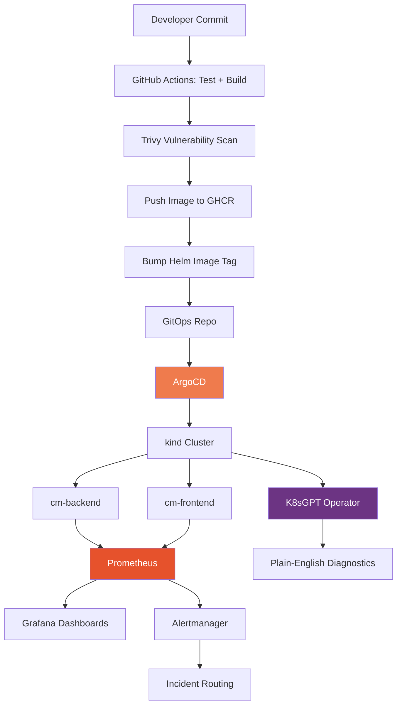

<div align="center">

# 🧠 ClusterMind

### AI-Powered Platform Health & GitOps Delivery Platform

A self-contained Kubernetes platform that ships itself, watches itself, and explains its own failures — built entirely on free, open-source tooling.

[](https://kind.sigs.k8s.io/)
[](https://argo-cd.readthedocs.io/)
[](https://helm.sh/)
[](https://prometheus.io/)
[](https://grafana.com/)
[](https://k8sgpt.ai/)
[](#license)

</div>

---

## 📖 Overview

**ClusterMind** is a production-style DevOps platform built to demonstrate the full lifecycle a real Kubernetes system runs on: code goes in, it ships itself through GitOps, and once it's live, it's continuously watched — by both metrics dashboards *and* an AI diagnostics layer that explains what's wrong in plain English.

It's split into two services (`cm-backend`, `cm-frontend`), deployed via a **two-repository GitOps pattern** — application source is fully separated from infrastructure/Helm manifests — with **ArgoCD** as the single source of truth reconciling the live cluster to Git, continuously.

> 💡 **Why this project exists:** Most portfolio projects stop at "I deployed an app with Docker and Kubernetes." ClusterMind goes further — it's built to answer the next question a real team asks: *how do you know it's healthy, and what happens when it isn't?*

---

## 🏗️ Architecture



**Two planes, one shared backbone:**

| Plane | What it does |
|---|---|
| 🔄 **Delivery Plane** | GitHub Actions → Trivy → GHCR → ArgoCD GitOps sync, fully automated from commit to cluster |
| 🩺 **Health Plane** | Prometheus + Grafana for live metrics, Alertmanager for incident routing, K8sGPT for continuous, AI-generated, plain-English cluster diagnostics |

---

## ✨ Features

- **GitOps-native delivery** — ArgoCD auto-sync with `selfHeal` and `prune` enabled; the cluster is never manually touched, only reconciled from Git
- **Two-repository separation** — application source and infrastructure/Helm manifests live independently, mirroring how real platform teams structure GitOps repos
- **Full observability stack** — Prometheus scraping via `ServiceMonitor`, custom Grafana dashboards tracking real-time RPS, request latency (p50/p99), and status-code breakdowns
- **Automated alerting** — Alertmanager routing rules on top of Prometheus alert thresholds
- **AI-powered cluster diagnostics** — K8sGPT deployed in-cluster to automatically detect and explain issues (pod failures, misconfigurations, resource errors) in plain English, cutting down manual `kubectl describe` debugging
- **Zero cloud cost** — the entire platform runs locally on `kind` (Kubernetes-in-Docker); no AWS/cloud bill required to reproduce or extend this project

---

## 🛠️ Tech Stack

| Category | Tools |
|---|---|
| Containers | Docker |
| Orchestration | Kubernetes (`kind`) |
| Packaging | Helm |
| CI | GitHub Actions |
| Security Scanning | Trivy |
| GitOps / CD | ArgoCD |
| Metrics | Prometheus |
| Dashboards | Grafana |
| Alerting | Alertmanager |
| AI Diagnostics | K8sGPT |

---

## 🚀 Getting Started

### Prerequisites
- [Docker](https://docs.docker.com/get-docker/)
- [kind](https://kind.sigs.k8s.io/)
- [kubectl](https://kubernetes.io/docs/tasks/tools/)
- [Helm](https://helm.sh/docs/intro/install/)
- [K8sGPT CLI](https://k8sgpt.ai/)

### 1. Spin up the cluster
```bash
kind create cluster --name clustermind
kubectl cluster-info --context kind-clustermind
```

### 2. Install ArgoCD
```bash
kubectl create namespace argocd
kubectl apply -n argocd -f https://raw.githubusercontent.com/argoproj/argo-cd/stable/manifests/install.yaml
kubectl port-forward svc/argocd-server -n argocd 8080:443
```

### 3. Deploy the GitOps Application
```bash
kubectl apply -f argocd/application.yaml
```
ArgoCD will take over from here — it syncs `cm-backend` and `cm-frontend` automatically from the GitOps repo.

### 4. Install the observability stack
```bash
helm repo add prometheus-community https://prometheus-community.github.io/helm-charts
helm install monitoring prometheus-community/kube-prometheus-stack -n monitoring --create-namespace
```

### 5. Install K8sGPT
```bash
helm repo add k8sgpt https://charts.k8sgpt.ai/
helm install release k8sgpt/k8sgpt-operator -n k8sgpt --create-namespace
kubectl apply -f k8sgpt/k8sgpt-cr.yaml
```

---

## 📊 Screenshots

> Add your own screenshots here — recommended: ArgoCD sync view, Grafana dashboard, and a K8sGPT diagnosis output.

| ArgoCD Sync | Grafana Dashboard |
|---|---|
|  |  |

---

## 🗺️ Roadmap

- [ ] Add Argo Rollouts for canary-style progressive delivery
- [ ] Add an AI-driven canary analysis service comparing baseline vs. canary metrics
- [ ] Route K8sGPT diagnostics to Slack automatically
- [ ] Add Grafana alerting dashboards specific to canary health

---

## 📁 Repository Structure

```
clustermind-app/          # Application source (cm-backend, cm-frontend)
clustermind-gitops/       # Helm charts, Kubernetes manifests, ArgoCD Application spec
├── charts/
│   ├── cm-backend/
│   └── cm-frontend/
└── argocd/
    └── application.yaml
```

---

## 👤 Author

**Navin Chandra**
DevOps Engineer | [LinkedIn](https://linkedin.com/in/chandranavinn) | [GitHub](https://github.com/chandranavinn)

---

## 📄 License

This project is licensed under the MIT License — see the [LICENSE](LICENSE) file for details.
